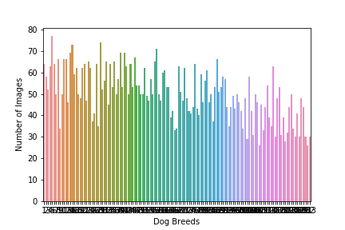
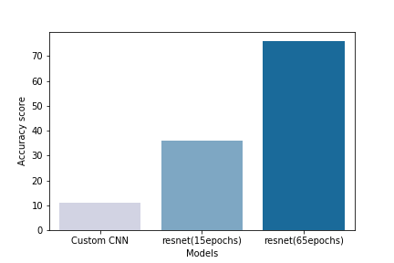

# Machine Learning Engineer Nanodegree
## Capstone Project
Kevin Henry      
January 13th, 2020

## I. Dog Breed Classifier

### Project Overview
Computer vision is a fascinating field where we try to write algorithms which make computers “see”  and understand  what it perceives. Vision may seem trivial to us because we have had this ability as long as we can remember. But it is a highly complicated problem and scientists all around the world are trying to come up with new ideas to improve the current state of the Art. The problem we are tackling here, is to identify the breed of a canine, an input image most resembles. Even for humans identifying some of the breeds that are highly similar in their appearance is very hard. Many solutions have been created by researchers [(Hsu, David)](http://cs231n.stanford.edu/reports/2015/pdfs/fcdh_FinalReport.pdf) , in this project we will be using a Deep Learning network called a Convolutional neural network(CNN) to solve our problem and also adapt pretrained models to our classification problem. The dataset we are going to be using is provided by Udacity called dogImages.

### Problem Statement
The project proposal is to create a Deep learning model that predicts which breeds of canines, an image belongs to.We will be creating a multi layer convolutional network to train our model.In the input data set, there are 133 different categories of canines and our model will predict which of the aforementioned categories, an input image belongs to.In addition to creating our own model for detecting the breed of an input dog image, we will also use transfer learning to adapt a pretrained model for this task.

### Metrics
Since the classes are slightly imbalanced, we will be using Log Loss as our evaluation metric.

## II. Analysis

### Data Exploration
For this project we will be using a dataset provided by udacity: “dogImages” . The “dogImages” dataset is divided into train, validate and  test sets. Each of these contain 133 categories of canine breeds. There are a total of 8351 images of dogs in the dataset. The dataset is not balanced, the classes have quite a bit of variation(+/-15 images for each class on average).

This data will be used to create a Deep Learning model to solve this classification problem.

During the training face , we will use the dogImages dataset to train our model. Each of the input images before passing into the model will be resized to (224,224) pixels and Normalized since our pytorch model expects this type of data.

### Exploratory Visualization

The dataset for this Project containes images of different Dogbreeds. The only interesting thing about it is that the data is highly imbalanced.
##### The graph below visualizes the Data Distribution.

The algorithm we are using to create the model is a Convolutional Neural Network. It was highly inspired by the connectivity pattern of Neurons in the Human Brain, the neurons in the retina only initiate action potentials for a partiular region of the visual field known as Receptive field, a collection of such field together encompass our entier visual area. Our CNN has many Convolutional layers , they are essentially feature extractors of our data. When we train the network we use  a 2 dimensional kernal to move across our data-these are the feature extractors mentioned above and apply mathematical functions to extract relevant features. These features extracted in the inital layers are later combined in the deeper layers to get to our final prediction.

In addition to the Convolutional layer we also add certain layers  between Convolutional layers to decrease our Computational load or to prevent overfitting. One of which is the Pooling layer, Pooling decreases the dimensionality of our data , and decreases our computational load . Another layer used quite often is a Dropout layer, it basicaly ignores or "drops out " some fraction of the nodes and the network will have to use other nodes to decrease the Loss, this helps in preventing our model from overfitting to the training data.

Using all the above methods we will train our model by going through all the data points shown in the graphs above, one pass through off the whole dataset is called an "epoch", As we train for more epochs our Loss should approach 0 and that is what we are aiming to do with the data.

### Algorithms and Techniques
The preprocessed data will be used to train a custom CNN which will have a final fully connected layer with 133 neurons , which is the number of categories of Dogs in our dataset.

After training, the model will be evaluated using the test dataset , and an accuracy score will be determined using the function “test” in our project code.

We will use some models from pytorch such as resnet50 or Densenet161 and adapt them to train these architectures with our data to see how it performs relative to our custom CNN model and perform Benchmarking.

### Benchmark
We will use transfer learning to adapt the resnet50 model to our classification problem and compare the results to our custom CNN model.The benchmark model that we are going to use , is the custom CNN model that we are creating for this project.

## III. Methodology

### Data Preprocessing
I have resized the image to (224,224) pixels, applied center crop and Standard Normalization.
  For the training data I have also applied RandomHorizontalFlip , this will give 
  randomness to the data. This type of data augmentation is done to prevent         overfitting. For the validation and test set I have not applied  RandomHorizontalFlip because there is no use in data augmentation as these data sets are only used to test the model.

### Implementation

For the first custom model :

---

Architecture:      
              
                       
(conv1): Conv2d(3, 16, kernel_size=(3, 3), stride=(1, 1), padding=(1, 1))         
activation: relu     
(pool): MaxPool2d(kernel_size=2, stride=2, padding=0, dilation=1,ceil_mode=False)        
(dropout): Dropout(p=0.3, inplace=False)    
         
               
               

(conv2): Conv2d(16, 32, kernel_size=(3, 3), stride=(1, 1), padding=(1, 1))       
activation: relu          
(pool): MaxPool2d(kernel_size=2, stride=2, padding=0, dilation=1,ceil_mode=False)      
(dropout): Dropout(p=0.3, inplace=False)      
          
         
(conv3): Conv2d(32, 64, kernel_size=(3, 3), stride=(1, 1), padding=(1, 1))      
activation: relu            
(pool): MaxPool2d(kernel_size=2, stride=2, padding=0, dilation=1,ceil_mode=False)         
(dropout): Dropout(p=0.3, inplace=False)             
         
        
(fc1): Linear(in_features=50176, out_features=500, bias=True)         
(batch_norm):BatchNorm1d(500,eps=1e05,momentum=0.1,affine=True, track_running_stats= True)        
activation: relu       
(dropout): Dropout(p=0.3, inplace=False)       
      
      
(fc2): Linear(in_features=500, out_features=133, bias=True)        
     
--------------------------------------------------------------------------------    

- I have 3 convolutional layers with a kernal size of 3 and stride 1.

- After every conv layer there is a Relu activation layer ,a (2,2) pooling layer to downsizes the image by 2 and a dropout layer to prevent overfitting.      

- After the convolutional layers I flatten the output of conv3 and pass it to the first fully connected layer(fc1) and apply batch normalization to normalize all the values.

- Finally I connect the first fuly connected layer(fc1) to a second and final fully connected layer(fc2) with output = num_classes(133 dog breeds).

---
---

     
For the resnet model I imported the resnet50 model from torch and replaced the final fully connected layer with a layer that ouputs the number of classes that I needed for my projects. I freezed the weights of the hidden layers and also initialized the weights of the final layer with a uniform distribution(torch.nn.init.xavier_uniform).Apart from this change the architecture has not been changed .

Creating the resnt model mentioned above was very easy since the only extra steps I took after importing my model was to replace the final layer and perform the operations mentioned above. Improvement in training the resnet model came solely by training for more epochs, I had an average increase of 1.5% in my accuracy score with every epoch.      

In creating the custom CNN, at first I didnt have droput layers for my second and third Convolutional layers (conv1,conv2), and they started to overfit really fast. Adding dropout layer after every Convolutional layer prevented overfitting and gave me a better validation loss.

### Refinement
I did not expect a good result from my custom model , because it was quite basic and I only trained it for 15 epochs. But my model overfit to the training data very fast, so I added dropout layers to prevent it , and it gave me a better validation score.

For the resnet model , it was a matter of training it more. At first I trained it for 15 epochs to compare the model to my custom model , and it had a 3x improvement, then I trained it for another 50 epochs which gave me a 7x improvement.

## IV. Results

### Model Evaluation and Validation

For the part where I used transfer Learning, my first choice was the Densenet architecture , but I soon realized it was too big and would take a lot of computing time. So I turned to my second choice which was the resnet model. I chose this model because it has done an amazing job in image classification and would have complicated feature extractors which would be very useful for my classification task. 

My final loss after a total of 65 epochs was approximately 1.5 , which  was really great. I tested it against the test set and the model had a test accuracy of 76 percent. I got really accurate results when I ran the model against some custom images too.The dog app that I wrote at the end of the project performed really good, and the results were accurate.

### Justification

My benchmark model was the custom CNN that I built. The resnet model that a trained had a 7x improvement over mu custom model. It is a great result when taking into consideration the size of the dataset and the number of epochs. The final model is quite capable of predicting dog breeds and the accuracy can be greatly improved if the model is trained for more epochs.The final model prediction accuracy was 76%.If we need a higher accuracy it is just a matter of training the model for more epochs.

I created a function where it takes as input an Image and gives as output the breed of dog the image most ressembles. I tested it on random images and my model performed really well . The function is very easy to use and the model generalizes really well , all the tests of the model gave accurate results. This shows us that our model is robust enough to use in a real world scenario that requires Dog breed classification.

## V. Conclusion

### Free-Form Visualization

In the process of completing this project I created three models , one of which was a custom CNN that I trained for 15 epochs , and another two were resnet models trained for 15 epochs and 65 epochs each . In the visualiztion below , you can see how the accuracy score has improved for every model .

#### Model Accuracy

### Reflection

My Project was to train Classifier that would classify the breed of a dog . At first I wrote a custom CNN architecture and trained it for 15 epochs. It had a 11% accuracy. After that I used transfer learning to train a resnet model , that was trained on ImageNet and converted the model to meet my classification model and trained it for a total of 65 epochs. It had a 76% accuracy.

Training the model on my local PC was not possible , so I had to use Sagemaker. I did not know how I could retrain a model from a .pt file , so that took me some time to figure out , but it felt great after I completed the training.The final model performed really well , in the project rubric a 60% accuracy was needed and I got a 76% accuracy. 

The model is capable of solving my initial problem of Dog Breed Classification with good accuracy.

### Improvement

- The resnet model's validation loss was decreasing with every epoch, so if I had trained it for more epochs , I would have gotten a better result.Currently the model outputs a particular breed for human input, I think this would also be solved with more runs through the data 

- A bigger diversified dataset for training would also enhance the performance of the model

- Hyperparameter tunning could also have brought about imporovements

- Using a more sophisticated  model like densenet would also show improvements

-----------